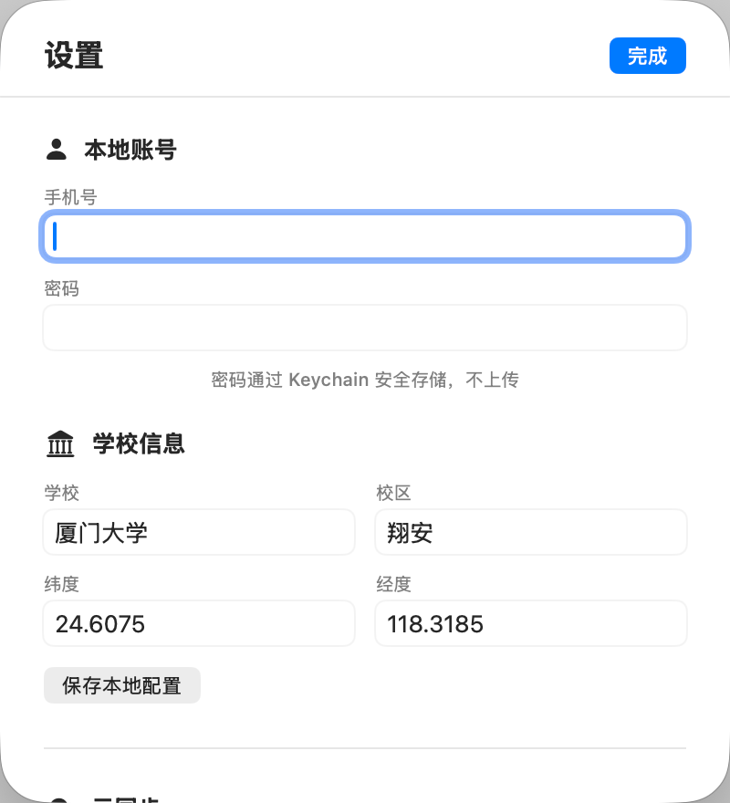
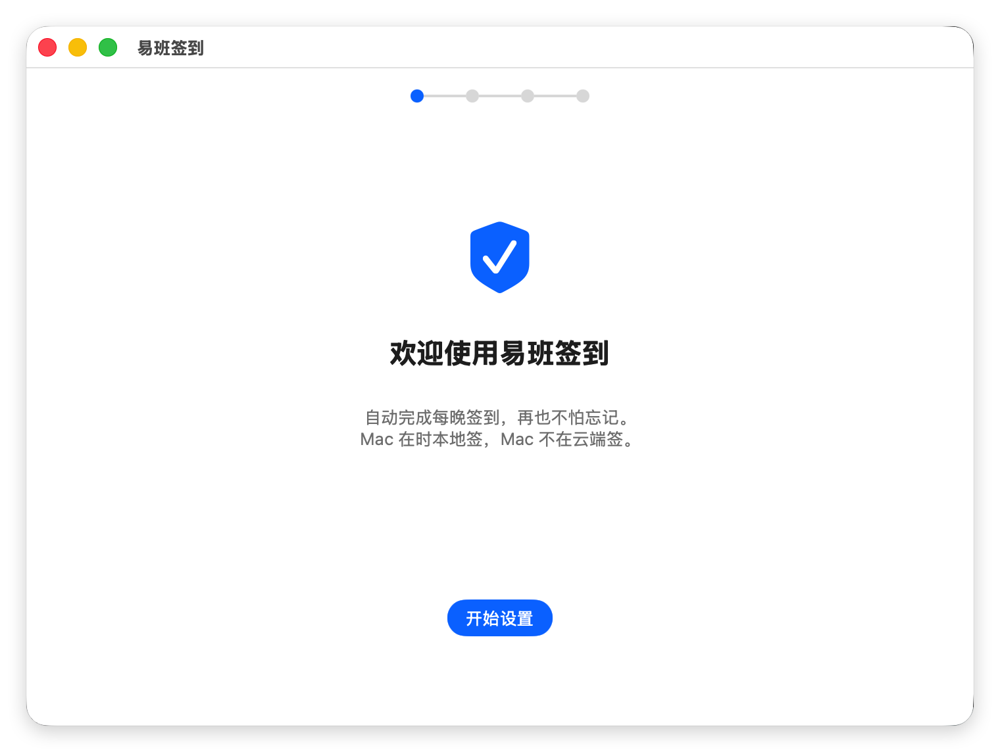
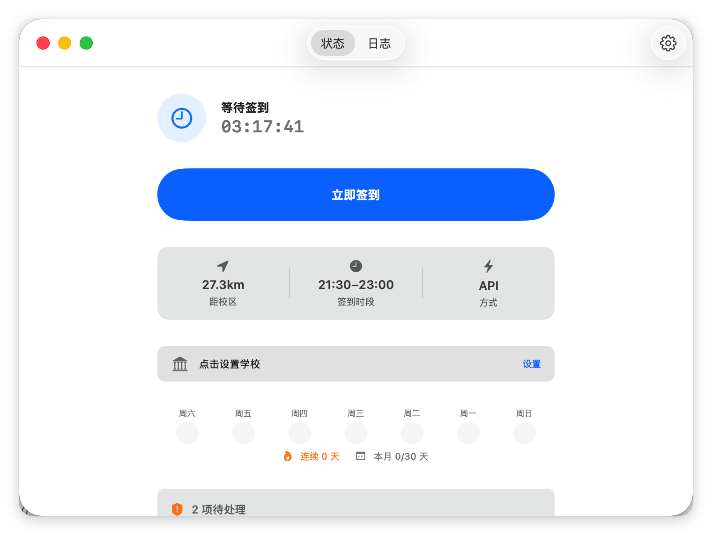

# yiban-checkin · 易班晚点签到

<p align="center">
  <em>macOS 全自动签到工具 — API 直达 + OCR 兜底 · Menu bar app · Cloud backup</em>
</p>

<p align="center">
  
  
  
  
</p>

<p align="center">
  
</p>
<p align="center">
  
</p>
<p align="center">
  
</p>

---

## 🇨🇳 中文说明 · 🇬🇧 [English](#english) below

### 这是什么

在 macOS 上**全自动完成易班晚点签到**。两种模式：

- **API 模式**（快） → 直接调易班接口，5 秒搞定
- **OCR 模式**（稳） → Vision 识别屏幕文字 + 模拟点击，API 挂了也能签

> ⚠️ **免责声明**: 本项目仅供学习交流。使用者自行承担风险，作者不对账号封禁等后果负责。

### 功能

| 功能 | 说明 |
|------|------|
| 🎯 双模签到 | API 优先，失败自动切 OCR（Vision + CGEvent） |
| 🤖 验证码识别 | 颜色+形状检测自动过图选验证，过不了自动等手动 |
| 📍 定位检测 | CoreLocation 实测，不在校区自动跳过 |
| 🔐 安全存储 | 密码/SendKey 走 macOS Keychain，不写明文 |
| 🖥 GUI + 菜单栏 | SwiftUI 面板 + 菜单栏图标（绿/橙/灰一眼看状态） |
| 📊 签到统计 | 连续天数、本月成功率、7天状态条 |
| 🔔 微信推送 | Server酱 推送签到结果到微信 |
| ☁️ 云备份 | GitHub Actions 每天 21:30 执行，Mac 关机也能签 |
| 🔧 诊断工具 | 权限检查 + API 连通性测试 |

### 安装

```bash
cd yiban-checkin
bash scripts/install.sh
```

权限配置：系统设置 → 隐私与安全性 → **辅助功能**（加终端）+ **定位服务**（开启）

### 使用

```bash
# CLI
~/bin/yiban-checkin                    # 手动签到
~/bin/yiban-checkin --diagnose         # 系统诊断
~/bin/yiban-checkin --check-api        # API 连通性测试
~/bin/yiban-checkin --inspect          # UI 探查（调试用）

# GUI
open /Applications/YibanCheckin.app    # 打开面板 + 菜单栏图标
```

### 云备份（推荐）

即使 Mac 关机也能签到：[详见下方](#-cloud-backup)

### 项目结构

```
Sources/
├── Core/                       # 共用核心库
│   ├── YibanAPI.swift          # REST API（参照 fyiban）
│   ├── AppAutomator.swift      # OCR + 鼠标键盘自动化
│   ├── CheckinOrchestrator.swift # 统一签到流程
│   ├── CheckinHistory.swift    # 签到历史统计
│   ├── ScreenCapture.swift     # 截图工具
│   ├── VerificationSolver.swift # 验证码识别
│   ├── LocationChecker.swift   # CoreLocation 定位
│   ├── Config.swift            # 配置管理（含 Keychain）
│   ├── Keychain.swift          # macOS Keychain 封装
│   ├── Logger.swift            # 日志（可配级别）
│   ├── Notifier.swift          # 通知 + Server酱推送
│   └── PermissionChecker.swift # 权限诊断
├── CLI/main.swift              # 命令行入口
└── GUI/                        # macOS App (SwiftUI)
    ├── YibanCheckinApp.swift
    ├── MenuBarController.swift
    ├── DashboardView.swift     # 状态 + 统计 + 诊断
    ├── SettingsView.swift
    ├── CheckinManager.swift
    └── LogViewer.swift
```

### 技术栈

| 技术 | 用途 |
|------|------|
| Swift 5.9 | 主语言 |
| SwiftUI | GUI |
| Vision | OCR 文字识别 |
| CGEvent | 鼠标键盘模拟 |
| CoreLocation | 定位+地理围栏 |
| Security (Keychain) | 敏感数据存储 |
| launchd | 定时任务调度 |

**零第三方依赖** — 纯 Apple 框架。

### 相关项目

- [Qs315490/fyiban](https://github.com/Qs315490/fyiban) — Python 易班 API 库（本项目 API 流程参照）

### 许可证

[GPL-3.0](LICENSE) — 你可以自由使用、修改、分发，但衍生作品也必须开源。

---

## English

### What is this?

A **macOS utility that automatically checks in for 易班 (YiBan) evening attendance**. Two modes:

- **API mode** — direct REST calls, finishes in ~5 seconds
- **OCR mode** — Vision text recognition + simulated clicks, fallback when API is down

### Features

- 🎯 **Dual-mode check-in**: API first, automatic OCR fallback
- 🤖 **CAPTCHA solver**: Color + shape recognition for automatic bypass
- 📍 **Geofencing**: Skip check-in when outside campus (CoreLocation)
- 🔐 **Keychain storage**: No plaintext credentials on disk
- 🖥 **Menu bar app**: Status icon (green/orange/grey) + quick actions
- 📊 **History & stats**: Streak tracking, monthly success rate, 7-day status
- 🔔 **Push notifications**: WeChat via Server酱
- ☁️ **Cloud backup**: GitHub Actions runs every day at 21:30 CST
- 🔧 **Diagnostics**: Permission checker + API connectivity test
- **Zero dependencies**: Apple frameworks only

### Quick Start

```bash
cd yiban-checkin
bash scripts/install.sh

# Grant Accessibility permission in System Settings
# Then:
~/bin/yiban-checkin                 # Manual check-in
~/bin/yiban-checkin --diagnose      # Run diagnostics
```

### Cloud Backup

1. Fork this repo
2. Add these GitHub Secrets:
   - `YIBAN_PHONE` — phone number
   - `YIBAN_PASSWORD` — password
   - `YIBAN_LAT` / `YIBAN_LNG` — campus coordinates
   - `YIBAN_SCHOOL` / `YIBAN_CAMPUS` — school name
   - `YIBAN_ACT` — 校本化 App ID (default: `iapp7463` for 福州大学)
   - `YIBAN_CLIENT_ID` — OAuth client ID (default: `95626fa3080300ea`)
   - `PUSH_KEY` — Server酱 SendKey (optional)
3. Done! Runs at 21:30 CST daily via `.github/workflows/checkin.yml`

```bash
# Test locally:
pip3 install -r scripts/requirements.txt
python3 scripts/cloud_checkin.py
```

### Comparison with fyiban

| | fyiban | yiban-checkin |
|---|--------|---------------|
| Language | Python | Swift |
| Platform | Cross-platform | macOS only |
| GUI | ❌ | ✅ Menu bar + SwiftUI |
| OCR fallback | ❌ | ✅ Vision + CGEvent |
| CAPTCHA solve | ❌ | ✅ Auto color/shape |
| Real location | ❌ (params only) | ✅ CoreLocation |
| Cloud deploy | ✅ Docker/GitHub Actions | ✅ GitHub Actions |
| Credential storage | Config file | macOS Keychain |

### License

[GPL-3.0](LICENSE) — Free to use, modify, and distribute. Derivative works must also be open source.
